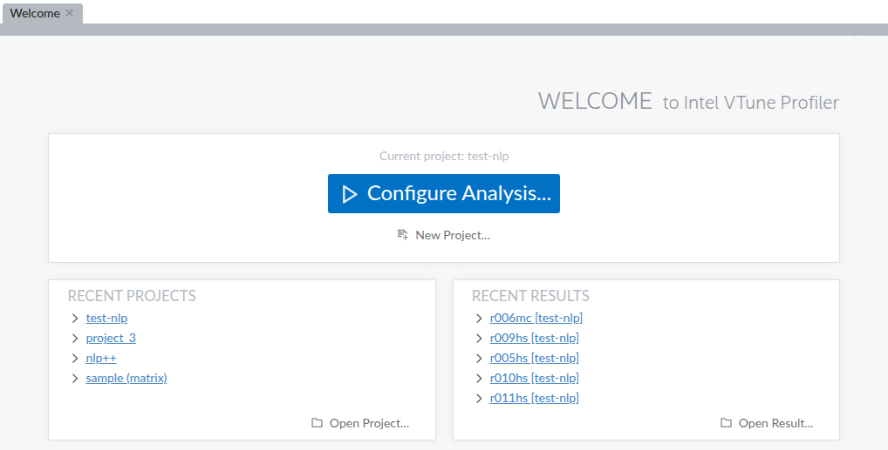
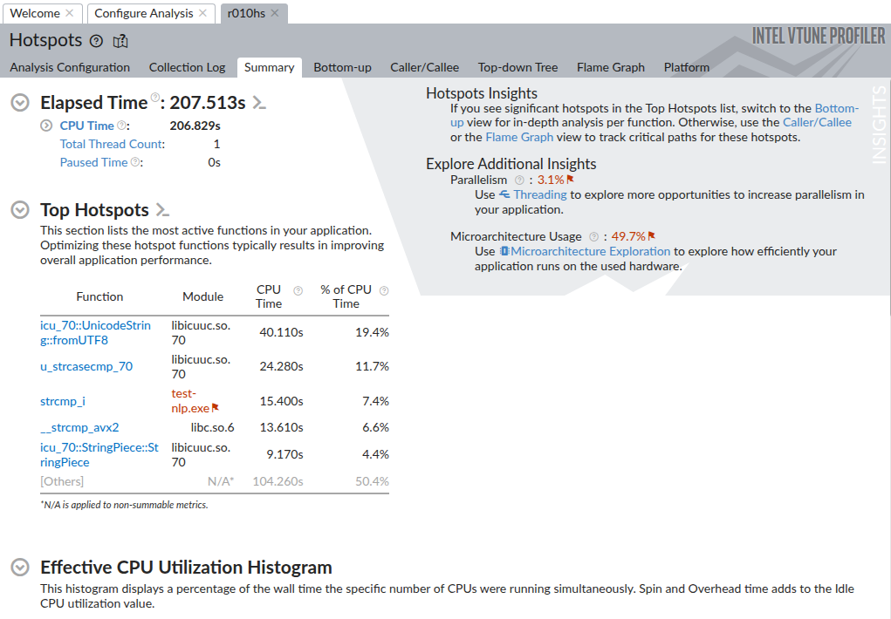
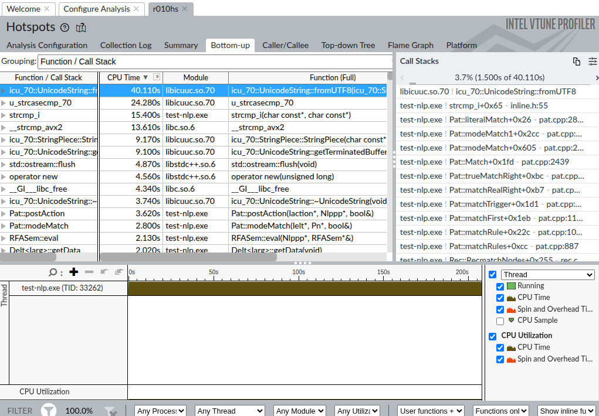

# Profiling NLP Engine with Intel VTune Profiler

## Step 1: Install Intel VTune Profiler

Download and install Intel VTune Profiler from the official site:  
[https://www.intel.com/content/www/us/en/developer/tools/oneapi/vtune-profiler-download.html?operatingsystem=linux&linux-install-type=offline](https://www.intel.com/content/www/us/en/developer/tools/oneapi/vtune-profiler-download.html?operatingsystem=linux&linux-install-type=offline)

## Step 2: Build the nlp-engine

Build the `nlp-engine` if you have made any changes.

## Step 3: Launch VTune GUI

Go to your VTune installation directory and run:

```source ./setvars.sh 
vtune-gui
```

Reference: [Launching VTune Profiler](https://www.intel.com/content/www/us/en/docs/vtune-profiler/user-guide/2023-2/launch.html)

A GUI should pop up. You will be at the welcome page—click on **Configure Analysis**:



## Step 4: Configure Analysis

You will see the configuration screen:


- Choose the path to your binary file and set any required parameters.
- There are two analyses you should use:
  - **Hotspots** (for CPU time)
  - **Memory Consumption** (for memory allocation)

If hardware-mode sampling is not available (which is usually the case and is a pain to set up), set the values to `0` in the following files (paths are relative to the install dir):

```
/proc/sys/kernel/perf_event_paranoid
/proc/sys/kernel/yama/ptrace_scope
```

## Step 5: Run the Analysis

Click **Run** and wait for the analysis to complete.  
If the data size limit is too low, you can modify it in the advanced settings on the Configure Analysis page.

## Step 6: View Results

After the analysis is done, you will see the summary page and useful logs like **Bottom-up**, which provides per-function metrics.

Example summary and bottom-up views:



